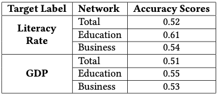

# Analysis of Migration Network of India
## Mining Large Network - Academic Project
---

Migration network is one of the networks which were less studied in the area of Graph Machine Learning. Specially in India as most diversed country in world shows large migration and recorded each decade. So, in this we represent the migration happening between different states and union territories of India as a network and then apply different techniques to identify some pattern in the migration. We apply weighted link prediction methodology to get the projected counts of migrants for different areas of the country. Next we obtain the node embeddings of the migration network using Graph Convolution Network (GCN) by incorporating node features like in-migrants count, out-migrants count, population, etc. of the state/UT which are represented as nodes. Then we showed that count of migrants to a place is related to the literacy rate, GDP of the place. This kind of analysis can be of great use for the Government agencies involved in planning the development of cities for the growing population.

## Dataset

## Methods

### Network Analysis

In this we have done exploratory analysis of the data by representing the data using the different graphs and drawing conclusions using different algorithms like **PageRank** & **HITS algorithm**.

### Node Classification Using GCN

ow based on the literacy rate of the state we assign labels to each state denoting the class to which the state belongs i.e. high literacy rate or a low literacy rate. Similarly we assign labels based on the GDP of the state. We have used the **deep learning** method is used to for classification purpose.

### Weighted Link Prediction

We use method described by Xiao in which he uses the weights of links for link prediction task by modifying the traditional **Common Neighbour**, **Adamic Adar** and **Resource Alloctor**. It first creates a simple model which uses the existing methods and remove constant 1 and replace by weights from node pair to that common node.

 

# Contributors

* [**Anchit Gupta**](http://anchitgupt.github.io/)
* **Ankit Agarwal**

All right reserved to repository owners.

